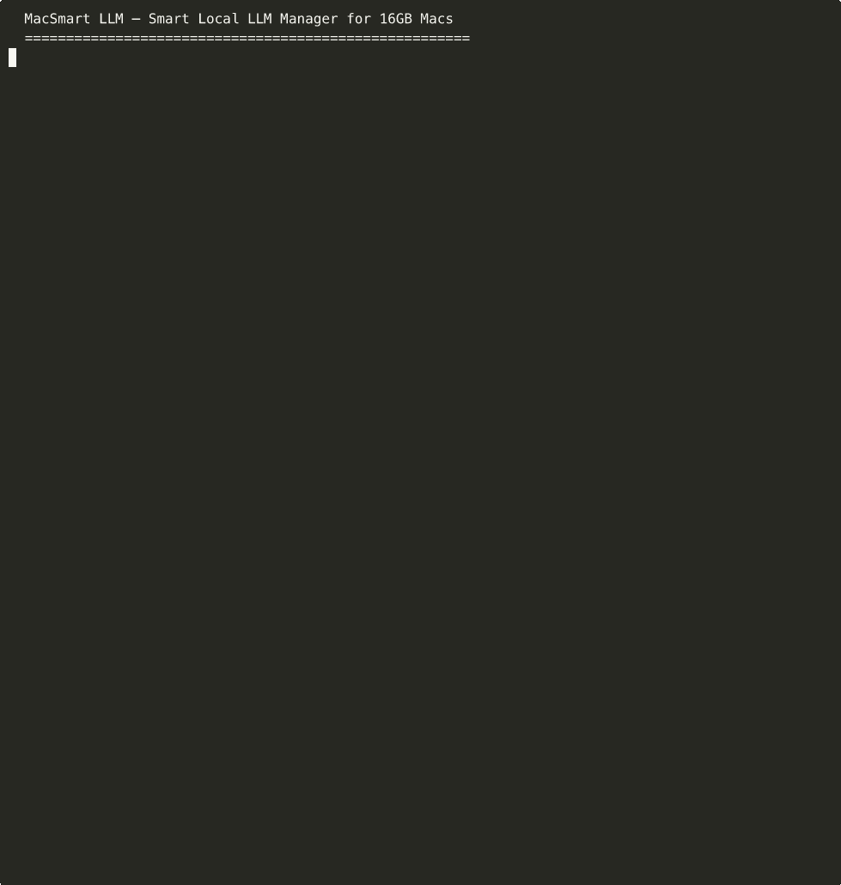

# MacSmart LLM

**Memory-intelligent local LLM orchestration for 16GB Apple Silicon Macs.**

Unlike LM Studio or Ollama which treat all Macs the same, MacSmart actively monitors available memory, thermal state, and battery level to recommend and manage the best model + quantization for your current system state.



## Why?

- **16GB is the most common MacBook config** but completely ignored by benchmarking research
- Existing tools let users download models that **crash or swap-thrash** on 16GB
- No tool auto-selects the best model/quantization based on *actual available* memory
- Apple Silicon Neural Accelerators (via MLX) are **untapped on 16GB configs**

## Features

- **System Profiler** — Detect chip (M1–M5), GPU cores, memory bandwidth, thermal state, battery
- **Model Recommender** — Auto-select the best model + quantization for your available memory
- **Benchmark Runner** — Measure TTFT, tokens/sec, peak memory, swap usage, energy
- **Memory Watchdog** — Real-time memory pressure monitoring with live Rich UI
- **Download Manager** — Download, list, and manage models from HuggingFace Hub

## Installation

```bash
# Clone the repo
git clone https://github.com/awneesht/m5-llm-benchmark.git
cd m5-llm-benchmark

# Install (using pip)
pip install -e ".[dev]"
```

## Usage

```bash
# Show system profile (chip, memory, thermal, battery)
macsmart profile

# Get model recommendations for your current memory
macsmart recommend

# Recommend for a specific task with custom memory budget
macsmart recommend --task coding --memory 10

# Download a model
macsmart download mlx-community/Qwen2.5-7B-Instruct-4bit

# List cached models
macsmart models

# Benchmark a model
macsmart benchmark mlx-community/Qwen2.5-7B-Instruct-4bit

# Watch memory pressure in real-time
macsmart watch

# Delete a cached model
macsmart delete mlx-community/Qwen2.5-7B-Instruct-4bit

# All commands support --json-output for scripting
macsmart profile --json-output
macsmart recommend --json-output
```

## 16GB Memory Budget

| Component | Memory |
|-----------|--------|
| macOS + system | ~3–4 GB |
| Typical user apps | ~1–2 GB |
| **Available for LLM** | **~10–12 GB** |
| Safe model size (no swap) | **~8–9 GB** |
| Max model size (some swap OK) | **~12–14 GB** |

## Requirements

- macOS with Apple Silicon (M1/M2/M3/M4/M5)
- Python 3.11+
- 16GB RAM (optimized for this config, works on others too)

## Development

```bash
# Install dev dependencies
pip install -e ".[dev]"

# Run tests
pytest

# Run with coverage
pytest --cov=macsmart

# Run a single test file
pytest tests/test_benchmark.py -v
```

## License

MIT
